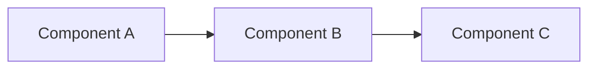

# Common Slide Patterns

## Title Slide

```markdown
# [[note-name| Presentation Title]]

---
```

Or with subtitle:

```markdown
# Main Title

## Subtitle or Context

---
```

## Agenda Slide

```markdown
# Agenda

xxx

## Section 1

- Topic A
+ Topic B
+ Topic C

notes:
  Brief overview of section 1

xxx

## Section 2

- Topic D
+ Topic E

notes:
  Brief overview of section 2

---
```

## Section Divider

```markdown
# Major Section Title

xxx

Brief introduction or tagline

notes:
  Speaker notes about this section

---
```

## Content Slide with Bullets

```markdown
## Topic Title

- Main point 1
+ Main point 2 (appears on click)
+ Main point 3 (appears on next click)

notes:
  Context and talking points for presenter

---
```

## Content Slide with Nested Bullets

```markdown
## Topic Title

- Main point
  - Supporting detail
  - Another detail
+ Second main point
  - Its supporting detail

notes:
  Presenter context

---
```

## Deep Dive Pattern (Vertical Slides)

```markdown
# Main Topic

xxx

High-level overview or key takeaway

xxx

## Detail 1

Deeper explanation

xxx

## Detail 2

More specific information

xxx

**Next topic** <i class="fa-solid fa-arrow-right"></i>

**Deeper**
<i class="fa-solid fa-arrow-down"></i>

xxx

### Very Specific Detail

Technical implementation or example

---
```

## Code Demonstration

````markdown
## Implementation

```python
def example():
    return "Hello, World!"
```

notes:
  Explain the code and its purpose

---
````

## Code with Progressive Highlighting

````markdown
## Step-by-Step

```python [1|3|5|1-5]
def process_data(data):
    # Clean the data
    cleaned = clean(data)
    # Transform it
    return transform(cleaned)
```

notes:
  Walk through each part of the code

---
````

## Comparison Slide

```markdown
## Option A vs Option B

**Option A:**
- Pro 1
- Pro 2
- Con 1

**Option B:**
- Pro 1
- Pro 2
- Con 1

notes:
  Context for the comparison

---
```

## Two-Column Layout

```markdown
## Comparison

::: split

**Left Side**
- Point 1
- Point 2

+++

**Right Side**
- Point 1
- Point 2

:::

---
```

## Blockquote/Callout Slide

```markdown
## Key Insight

> [!tip] Important
> This is a critical takeaway that deserves emphasis

notes:
  Elaborate on why this matters

---
```

## Image Slide

```markdown
## Visual Example


notes:
  Explain what the image shows

---
```

## Diagram Slide

```markdown
## Architecture



notes:
  Walk through the diagram components

---
```

## Question Slide

```markdown
## Key Question

**Question:** Why does this matter?

xxx

## The Answer

+ Reason 1
+ Reason 2
+ Reason 3

notes:
  Build suspense before revealing the answer

---
```

## Takeaways Slide

```markdown
## Key Takeaways

xxx

- First major point
+ Second major point
+ Third major point

notes:
  Summarize the main messages

xxx

Emphasize the most important takeaway

---
```

## Resources Slide

```markdown
## Resources

- **Documentation:** https://example.com/docs
+ **Tutorial:** https://example.com/tutorial
+ **Examples:** https://github.com/example

notes:
  Provide context for each resource

---
```

## Questions Slide

```markdown
# Questions?

xxx

## Contact / Resources

Additional information or contact details

notes:
  Open floor for discussion

---
```

## Table Pattern

```markdown
## Comparison Matrix

| Feature | Option A | Option B |
| ------- | -------- | -------- |
| Speed   | Fast     | Slow     |
| Cost    | High     | Low      |

notes:
  Explain the trade-offs

---
```

## Progressive Reveal Pattern

```markdown
## Building the Concept

First layer of understanding

xxx

First layer + second layer

xxx

Complete picture with all layers

notes:
  Guide audience through complexity step by step

---
```

## Emphasis Pattern

```markdown
## Critical Point

Simple statement

xxx

**Emphasized statement**

xxx

# VERY EMPHASIZED

notes:
  Build emphasis through repetition and sizing

---
```

## Navigation Helper Pattern

```markdown
## Topic Overview

Content here

xxx

**Next topic** <i class="fa-solid fa-arrow-right"></i>

**Deeper**
<i class="fa-solid fa-arrow-down"></i>

xxx

## Deeper Detail

Detailed content

---
```

## Multi-Step Process

```markdown
## Process Overview

1. Step 1
2. Step 2
3. Step 3

xxx

### Step 1: Details

Detailed explanation

xxx

### Step 2: Details

Detailed explanation

xxx

### Step 3: Details

Detailed explanation

---
```

## Example + Explanation

```markdown
## Concept

Explanation of the concept

xxx

**Example:**

```code
example_code()
```

notes:
  Tie the example back to the concept

---
```
