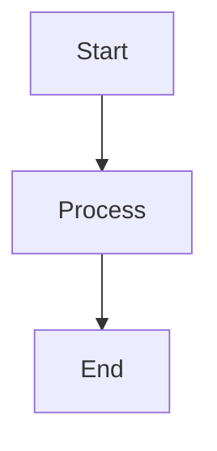

# Obsidian Slides Extended Syntax Reference

## Core Slide Separators

### Horizontal Slides (---)
Use three dashes to create a new horizontal slide (main section break):

```markdown
# First Section

---

# Second Section
```

### Vertical Slides (xxx or custom)
Use `xxx` (or custom `verticalSeparator` from frontmatter) to create vertical sub-slides:

```markdown
# Main Topic

xxx

## Sub-topic 1

xxx

## Sub-topic 2
```

Navigation: Horizontal slides go left/right, vertical slides go up/down.

## Frontmatter Configuration

Place YAML frontmatter at the top of the file:

```yaml
---
title: My Presentation Title
theme: blood
verticalSeparator: xxx
hash: true
---
```

### Common Frontmatter Options

- `title`: Presentation title
- `theme`: Visual theme (blood, black, white, league, sky, beige, simple, serif, night, moon, solarized)
- `verticalSeparator`: Custom separator for vertical slides (default: `xxx`)
- `hash`: Enable URL hash navigation (true/false)
- `transition`: Slide transition effect (none, fade, slide, convex, concave, zoom)
- `controls`: Show navigation controls (true/false)
- `progress`: Show progress bar (true/false)
- `slideNumber`: Show slide numbers (true/false)

## Fragment Notation (Incremental Reveals)

Use `+` at the start of list items to make them appear incrementally:

```markdown
- First item (appears immediately)
+ Second item (appears on click)
+ Third item (appears on next click)
```

Also works with nested lists and other elements.

## Speaker Notes

Add presenter notes that appear in speaker view but not on slides:

### Single-line notes:
```markdown
note: This is a presenter note
```

### Multi-line notes:
```markdown
notes:
  This is a longer presenter note
  that spans multiple lines
```

Notes are typically placed after slide content.

## Navigation Indicators

Add visual navigation hints to slides:

```markdown
**Next topic** <i class="fa-solid fa-arrow-right"></i>

**Deeper**
<i class="fa-solid fa-arrow-down"></i>
```

Uses Font Awesome icons (available by default).

## Text Formatting

Standard Markdown formatting applies:

- **Bold**: `**text**` or `__text__`
- *Italic*: `*text*` or `_text_`
- `Code`: `` `code` ``
- [Links](#): `[text](url)`
- Images: ``

## Code Blocks

### Basic code block:
````markdown
```python
def hello():
    print("Hello, World!")
```
````

### With line highlighting:
````markdown
```python [1|3|1-3]
def hello():
    message = "Hello"
    print(message)
```
````

Line numbers in brackets define highlight sequences (shown incrementally).

## Lists

### Unordered:
```markdown
- Item 1
- Item 2
  - Nested item
```

### Ordered:
```markdown
1. First
2. Second
3. Third
```

### With fragments:
```markdown
- Always visible
+ Appears on click
+ Appears on next click
```

## Blockquotes

```markdown
> This is a blockquote
```

## Callouts (Obsidian-specific)

```markdown
> [!tip] Title
> Content here
```

Callout types: tip, note, warning, danger, example, quote, etc.

## Layout Components

### Split Layout
```markdown
::: split
Left content

+++

Right content
:::
```

### Grid Layout
```markdown
::: grid
Item 1

+++

Item 2

+++

Item 3
:::
```

## Slide Backgrounds

Add backgrounds to individual slides using HTML comments:

```markdown
<!-- .slide: data-background-color="#ff0000" -->

# Red Background Slide

---

<!-- .slide: data-background-image="image.jpg" -->

# Image Background Slide
```

## Special Features

### Stacked Elements (overlays)
```markdown
<div class="r-stack">
![[image1.png]]
![[image2.png]]  <!-- .element: class="fragment" -->
</div>
```

### Element Classes
Add classes to elements with HTML comments:

```markdown
Some text <!-- .element: class="fragment fade-in" -->
```

### Fragment Animations
- `fade-in`: Fade in
- `fade-out`: Fade out
- `fade-up`: Slide up while fading in
- `fade-down`: Slide down while fading in
- `grow`: Grow in size
- `shrink`: Shrink in size

## Tables

Standard Markdown tables:

```markdown
| Column 1 | Column 2 |
| -------- | -------- |
| Data 1   | Data 2   |
```

## Mermaid Diagrams

```markdown

```

## Icons (Font Awesome)

Use Font Awesome icons directly:

```markdown
<i class="fa-solid fa-arrow-right"></i>
<i class="fa-solid fa-check"></i>
<i class="fa-solid fa-times"></i>
```

## Internal Links

Link to other slides using anchors:

```markdown
[Jump to Section](#section-title)
```

Or use slide numbers:

```markdown
[Go to slide 5](#/5)
```

## Best Practices

1. **Keep slides concise** - One main idea per slide
2. **Use vertical slides for details** - Main points horizontal, details vertical
3. **Leverage fragments** - Reveal content progressively with `+`
4. **Add speaker notes** - Always include notes for presentation context
5. **Use navigation indicators** - Help audience understand slide structure
6. **Consistent formatting** - Stick to a pattern throughout the deck
7. **Test locally** - Preview slides in Obsidian before presenting
