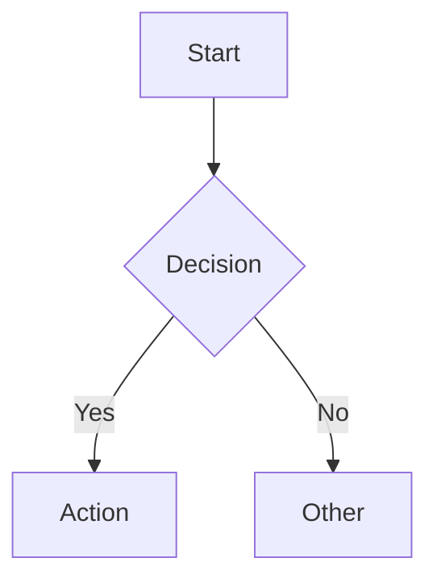
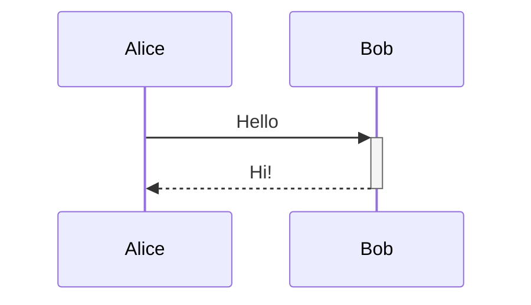
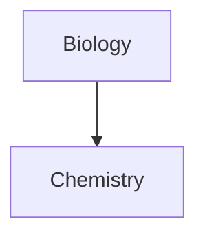

# Diagrams (Mermaid)

Use `mermaid` code blocks:

````md

```mermaid
graph TD
    A[Start] --> B{Decision}
    B -->|Yes| C[Action]
    B -->|No| D[Other]
```
````

````md

```mermaid
sequenceDiagram
    Alice->>+Bob: Hello
    Bob-->>-Alice: Hi!
```
````

Link to vault notes in diagrams:

````md

```mermaid
graph TD
    Biology --> Chemistry
    class Biology,Chemistry internal-link;
```
````
